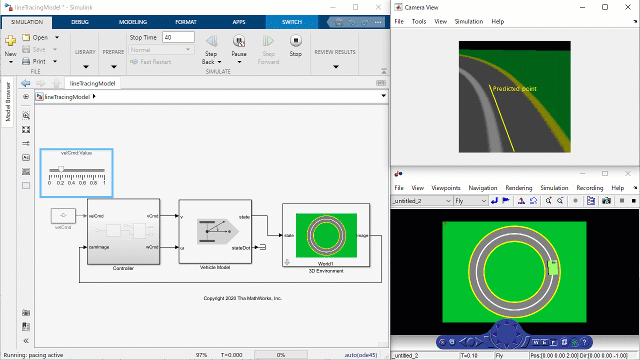

# MATLAB AI Robotics Workshop

This material outlines a hands-on workshop on learning how to develop AI-based autonomous mobile robot for university students and engineers of all skill levels. MATLAB and Simulink are utilized as an intuitive learning environment for deep learning and control algorithms with a 3D virtual simulation environment.

[Japanese version](README_JP.md)

## Setup 
### Simulation

MathWorks Products (http://www.mathworks.com)

Requires MATLAB release R2021a or newer
- [MATLAB&reg;](https://www.mathworks.com/products/matlab.html)
- [Simulink&reg;](https://www.mathworks.com/products/simulink.html)
- [Image Processing Toolbox&trade;](https://www.mathworks.com/products/image.html)
- [Computer Vision Toolbox&trade;](https://www.mathworks.com/products/computer-vision.html)
- [Deep Learning Toolbox&trade;](https://www.mathworks.com/products/deep-learning.html)
- [Parallel Computing Toolbox&trade;](https://www.mathworks.com/products/parallel-computing.html)
- [Robotics System Toolbox&trade;](https://www.mathworks.com/products/robotics.html)
- [Simulink 3D Animation&trade;](https://www.mathworks.com/products/3d-animation.html)

## Getting Started 

1. Launch MATLAB
2. Open `ai_robotics_workshop.prj`
3. Follow the opened Live Script

## Documentation

Please find the [PDF documentation](doc/AI_Robotics_Workshop.pdf) for details.

## License
The license for MATLAB AI Robotics Workshop is available in the [license.txt](license.txt) file in this GitHub repository.

## Community Support
[MATLAB Central](https://www.mathworks.com/matlabcentral)

Copyright 2021 The MathWorks, Inc.
